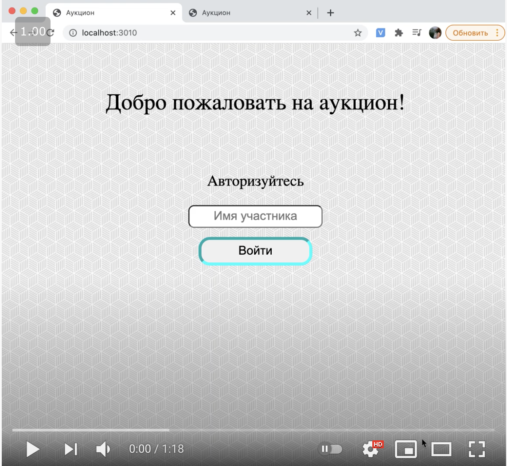

# web
Education course of web programming in Saint-Petersburg Electrotechnical University "LETI"

## 1. Tetris game
Technologies used in the project: Node.JS, JS, HTML, CSS

## 2. Electronic home library
Technologies used in the project: Express, W3.css, Pug, REST

## 4. Art auction
Technologies used in the project: jQuery UI, Express, WebSocket, Flow, Mocha, WebPack 

## 5. Stock exchange
Technologies used in the project: Express, Angular

